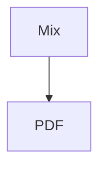

# Fixture F — Mixed

متن فارسی با **پررنگ** و *ایتالیک*.

- مورد یک
- مورد دو
    - تو در تو

`inline code` and:

```js
console.log('hello')
```

| جدول | مقدار |
|------|-------|
| یک   | ۱     |

Inline math $x_i$ and:

$$
\sum_{i=1}^{n} i = \frac{n (n+1)}{2}
$$



Long URL: https://example.com/path/to/a/very/long/resource?x=1&y=2
